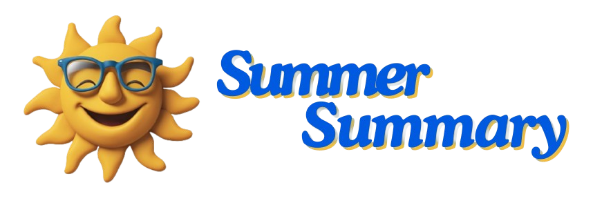

 



---
SummerSummary (SummSumm)

A Python GPT summarizer for YouTube videos with multi-LLM selection and summarizing personas (summarizers).

> [!IMPORTANT]
> To use Summer Summary you need to create a local (untracked) .env file which will include your preferred GPT API keys (eg. OpenAI, Anthropic etc.). When videos are summarized, these APIs may charge you even if the summary fails (due to ToS restrictions, context windows or otherwise). Be aware of the costs and always monitor the Billing dashboard of the service you're using.

## Supported LLMs
Currently the following LLMs are supported:
| Provider | Models |
|----------------|------------------|
| OpenAI            | gpt-3.5-turbo, gpt-4,  gpt-4-turbo-preview       |
|Anthropic| claude-3-opus-20240229, claude-3-sonnet-20240229, claude-3-haiku-20240307  |

## Requirements
Summer Summary is built for Python v3.12 and above.

## Documentation
All documentation can be currently found on this page. The more detailed docs are being prepared.

## Installation
1. Clone the repo
2. Go to root directory
3. Run ```pip install -r requirements.txt``` to install the PyPi dependencies
4. Create a ```.env``` file like: 
```env
OPENAI_API_KEY=your-openai-key
ANTHROPIC_API_ENV_KEY=your-anthropic-key
```
5. You're all set!

## How it works
Let's explain how Summer Summary works with an example:

You are a biohacker subscribed to all sorts of longevity YouTube podcasts. On average, a new 2hr episode is released every 1-2 days, but you don't have the time to go through each piece of content (7-14h a week needed).

You can use Summer Summary, plug in the YouTube video link and select the Biohacker summarizer to get a complete summary using the LLM of your choice. 

## CLI Arguments
| Argument | Options | Explanation |
|----------------|------------------|------------------|
| --api|openai, anthropic| Use the best model of an LLM service, i.e. OpenAI, Anthropic etc.|
| --os|None|A boolean. If present, we use the best open source LLM available locally|
| --url| URL string| The YouTube video link|
| --s|ba, pr, qt, default, None| The persona to summarize with|

## Summarizing Personas
| Title | CLI argument | Explanation |
|----------------|------------------|------------------|
| Biohacker Active |ba| A biohacker/ longevity focused summarizer, aiming to extract actionable, scientific outcomes you can use on your daily stack|
| Prepper |pr| A summarizer focused on self-reliance, off-the-grid living and autonomy, perfect for summarizing homesteading videos|
| Quant |qt| A quantitative analyst summarizer aimed at summarizing trading podcasts|

## Usage
1. Go to the root directory
2. Run ```python main.py --api openai --url https://www.youtube.com/watch?v=B94rbrZkXPI --s ba```
3. Get the summary in the CLI

## Contribution
Feel free to contribute to the project any way you like (especially with new summarizing personas). Submit a pull request and we'll review it.

## Notes
- As Summer Summary uses the video's transcript, very long videos may generate a transcript larger than the context window. Currently, Summer Summary will fail. Down the line we aim to mitigate.


## License
Summer Summary is released under the MIT License:

MIT License

Copyright (c) [2024]

Permission is hereby granted, free of charge, to any person obtaining a copy
of this software and associated documentation files (the "Software"), to deal
in the Software without restriction, including without limitation the rights
to use, copy, modify, merge, publish, distribute, sublicense, and/or sell
copies of the Software, and to permit persons to whom the Software is
furnished to do so, subject to the following conditions:

The above copyright notice and this permission notice shall be included in all
copies or substantial portions of the Software.

THE SOFTWARE IS PROVIDED "AS IS", WITHOUT WARRANTY OF ANY KIND, EXPRESS OR
IMPLIED, INCLUDING BUT NOT LIMITED TO THE WARRANTIES OF MERCHANTABILITY,
FITNESS FOR A PARTICULAR PURPOSE AND NONINFRINGEMENT. IN NO EVENT SHALL THE
AUTHORS OR COPYRIGHT HOLDERS BE LIABLE FOR ANY CLAIM, DAMAGES OR OTHER
LIABILITY, WHETHER IN AN ACTION OF CONTRACT, TORT OR OTHERWISE, ARISING FROM,
OUT OF OR IN CONNECTION WITH THE SOFTWARE OR THE USE OR OTHER DEALINGS IN THE
SOFTWARE.
